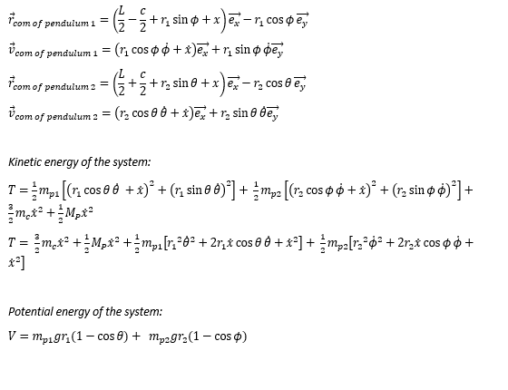

# 30.104_Dynamics_MATLAB_SIM
30.104 Dynamics 1D Project - Synchronous Pendulum

This project is an EPD Term 6 Mod, Dynamics

This module aims to discover the motion of the mechanical systems. 

This includes kinematics, force-momentum formulation for systems of particles and rigid bodies, work-energy concepts, virtual displacements and virtual work, Lagrange’s equations for systems of particles and rigid bodies, linearization of equations of motion, linear stability analysis, free and forced vibration of linear multi-degree of freedom models of mechanical systems.

This code is the 1D Project for this module. (Idk whether it would change in the future, and let's hope not.)

**1. Motivation** 

Our group intends to study the Synchronization of Pendulums. It was observed by Christiaan Huygens in 1665 that two pendulum clocks hanging from the same beam would synchronise overtime even if they were made to start out of sync (Huygens, 1665). This has hence been aptly known to be the Huygens synchronization. In our study, we intend to understand how this synchronisation happens between two pendulums and would like to model a system that would display this interesting phenomenon. 

Synchronization can be observed in our daily lives, and one example would be the synchronization of fireflies. This phenomenon is explained as phase synchronization, and it happens amongst fireflies whereby they synchronize their light emission when in large groups. There is no exact explanation for this phenomenon, and only existing hypotheses about the cause of this behaviour which involves diet, social interaction, and altitude. This shows that the topic of synchronisation is an area that requires more research.

**2. Technical description of your system** 

To properly study and simulate the synchronization of 2 pendulums, we set up the following test condition as shown below and define the critical masses and distances. The main platform with the 2 pendulums rests on 2 identical cans, which sit on the ground. The 2 pendulums oscillate by their independent angles 

**3. Mathematical model** 

In order to better scope the system, the following assumptions were made: 

- The cans are moving without slipping 
- Each pendulum is a point mass 
- The platform experiences linear viscosity in the x-direction only 

With these assumptions, we can solve for the equations of motion for the system using the Lagrange Equation. 

The system has 3 degrees of freedom, which are the 2 independent oscillations of the platform and the horizontal displacement of the platform. Thus, the generalised coordinates are: θ, ϕ and x, as shown in the above figure. 

Try out the code to code to find out how the pendulum reacts over time! Enjoy!
